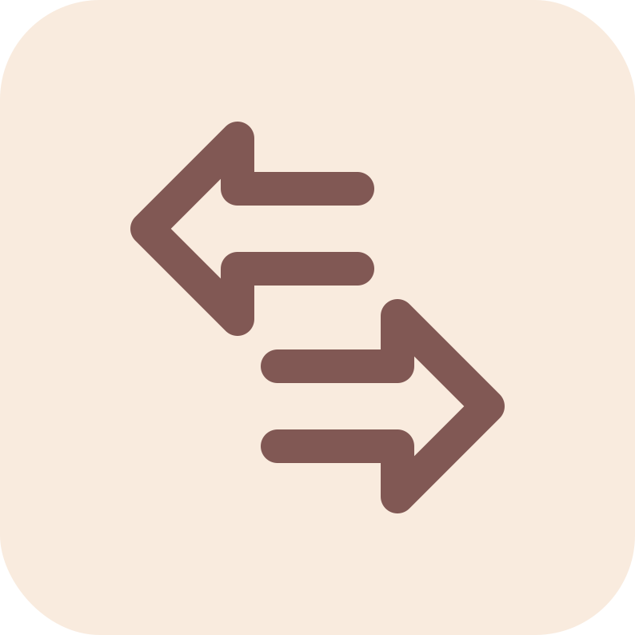
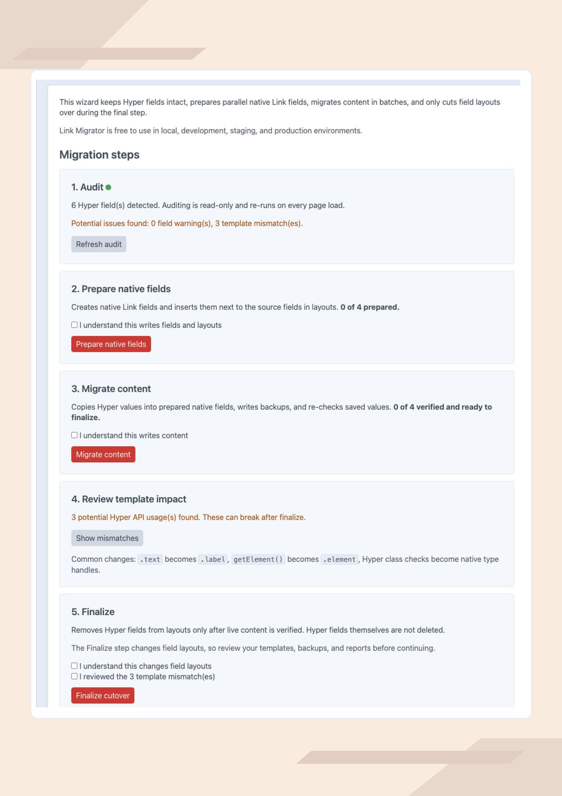

<p align="center">
  
</p>

<h1 align="center">Link Migrator</h1>

<p align="center">
  Migrate Verbb Hyper fields to Craft’s native Link field — staged, verified, and safe until the final step.
</p>

<p align="center">
  <a href="https://plugins.craftcms.com/link-migrator"></a>
  
  
  
</p>

---

**Link Migrator** moves [Verbb Hyper](https://plugins.craftcms.com/hyper) link fields to Craft’s built-in Link field without a leap of faith. Nothing is replaced in place: the plugin audits what you have, creates parallel native Link fields, copies and verifies every value, and only removes Hyper from your field layouts once everything checks out — with dry runs, backups, and reports at every stage.

Built for Craft teams retiring a plugin dependency without risking content or a broken frontend. This plugin is independent and unaffiliated; Hyper is a plugin by Verbb.

## How It Works

| Step | What happens | What it writes |
| ---- | ------------ | -------------- |
| 1. Audit | Detects Hyper fields, checks which are migratable, scans code for Hyper-only API usage | Nothing — read-only, repeatable |
| 2. Prepare | Creates a native Link field per Hyper field and inserts it next to the source in every layout (idempotent) | Fields + layouts |
| 3. Migrate content | Copies each Hyper value into its native field and verifies the saved result; optional per-element backups | Native field content only |
| 4. Template review | Reports Hyper-only API usage (`.text`, `getElement()`, …) that breaks after cutover | Nothing |
| 5. Finalize | Re-verifies every value against live content, then removes Hyper fields from layouts | Layouts |

Hyper fields and their values are never deleted — keep Hyper installed until your templates are updated and reports are clean.

Re-verification covers presence and link type. A Hyper value edited to a *different value of the same type* after content migration is not detected automatically — clear the native field for that element and re-run `content` to re-migrate it. Type changes and cleared native values are picked up by a re-run automatically.

## Features

- 🧭 **Control Panel wizard** — run the five steps from a guided CP screen with live per-field status.
- 🖥 **Full CLI workflow** — every step is a console command with `--dry-run=1` support; writes always require an explicit `--force=1`.
- ✅ **Verified, not assumed** — content readiness and finalize are gated by fresh re-verification of live content (presence and link type of every non-empty value), never by stored state.
- 💾 **Backups & reports** — optional per-element backup payloads, plus a JSON and log report for every run.
- ♻️ **Resumable & idempotent** — re-running skips verified values and recovers missing or drifted ones.
- 🔍 **Template mismatch scanner** — flags Hyper-only API usage in templates, modules, and config; exits non-zero for CI.
- 🔒 **Safety gates** — finalize refuses while values are unverified or template mismatches are unacknowledged.

## Supported Link Types

| Hyper type | Native Link type |
| ---------- | ---------------- |
| URL | `url` |
| Entry | `entry` |
| Asset | `asset` |
| Category | `category` |
| Email | `email` |
| Phone | `tel` |
| SMS | `sms` |

Label, new-tab target, URL suffix, title, class, id, and rel attributes are migrated. Multi-link Hyper fields, embed-only data, and link types without a native equivalent are unsupported: they are skipped and reported, never silently coerced. Custom or unsupported types downgrade to a native URL link only when a scalar URL-like value exists.

## Requirements

- PHP 8.2+
- Craft CMS 5.3+ (5.6+ recommended for the fuller native Link field set)
- Verbb Hyper still installed (until the migration is complete)

## Installation

Install from the **Plugin Store** in the Craft Control Panel (search for *Link Migrator*), or with Composer:

```bash
composer require luremo/craft-link-migrator
php craft plugin/install link-migrator
```

## Quick Start

Dry-run everything first, then run each stage for real:

```bash
php craft link-migrator/migrate/audit
php craft link-migrator/migrate/mismatches
php craft link-migrator/migrate/prepare-fields --dry-run=1
php craft link-migrator/migrate/prepare-fields --force=1
php craft link-migrator/migrate/content --dry-run=1
php craft link-migrator/migrate/content --force=1 --create-backup=1
php craft link-migrator/migrate/status
php craft link-migrator/migrate/finalize --dry-run=1
php craft link-migrator/migrate/finalize --force=1
```

Or open **Link Migrator** in the Control Panel and follow the wizard (admin-only). For large sites, prefer the CLI — content migration is batched (`--batch-size=100`) and resumable. A single field can be targeted everywhere with `--field=<handle>`.

## Commands

| Command | What it does |
| ------- | ------------ |
| `migrate/audit` | Read-only audit of Hyper fields, supported mappings, and code references |
| `migrate/prepare-fields` | Creates native Link fields and adds them to the source layouts |
| `migrate/content` | Migrates content into prepared fields; `--create-backup=1` writes per-element backups |
| `migrate/status` | Per-field workflow phase and content counters |
| `migrate/mismatches` | Scans templates/modules for Hyper-only API usage; non-zero exit if found |
| `migrate/finalize` | Removes Hyper fields from layouts after re-verifying all content |
| `migrate/rollback-info` | Informational summary of migration state and backups |

Non-dry runs of `prepare-fields`, `content`, and `finalize` require `--force=1`. If the mismatch scan found references, `finalize` additionally requires `--acknowledge-mismatches=1`.

## Template Changes

Hyper and the native Link field are not API-identical. The most common changes:

| Hyper | Native Link |
| ----- | ----------- |
| `.text` / `.linkText` | `.label` |
| `linkValue` | `.value` or `.url` |
| `getElement()` / `hasElement()` | `.element` |
| `verbb\hyper\links\Entry` type checks | type handles like `entry`, `url` |
| `getHtml()`, `getData()` | no equivalent — render manually |

GraphQL output shape also differs. See [docs/TEMPLATE-IMPACT.md](docs/TEMPLATE-IMPACT.md) for the full guide; `migrate/mismatches` finds these usages for you but is a guide, not a proof.

## Reports, Backups & State

- Every run writes a JSON + log report to `storage/runtime/link-migrator/`.
- Backups (with `--create-backup=1`) go to `storage/runtime/link-migrator/backups/`.
- Migration state lives in the `linkmigrator_migrations` table, keyed by field UID, element, and site — this is what makes runs resumable. `rollback-info` is informational only; keep normal database backups before any non-dry run.

## Pricing & License

One license, everything included: **$5** via the [Craft Plugin Store](https://plugins.craftcms.com/link-migrator). No editions, no feature gates — `--force=1` is a safety confirmation, not a paywall.

Commercial license — see [LICENSE.md](LICENSE.md).

## Support

- **Bug reports & migration edge cases:** [GitHub Issues](https://github.com/LuremoDigital/Link-migration/issues) (please include reproduction steps).
- **Changelog:** [CHANGELOG.md](CHANGELOG.md)

## Screenshots

<p align="center"></p>
<p align="center"><em>The staged wizard — audit, prepare, migrate, review, finalize, with live per-field status.</em></p>

<p align="center">Built by <a href="https://github.com/LuremoDigital">Luremo</a> for the Craft CMS community.</p>
